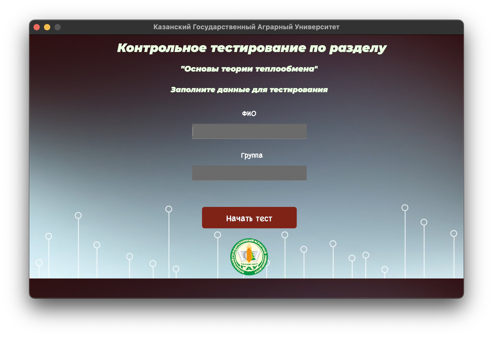
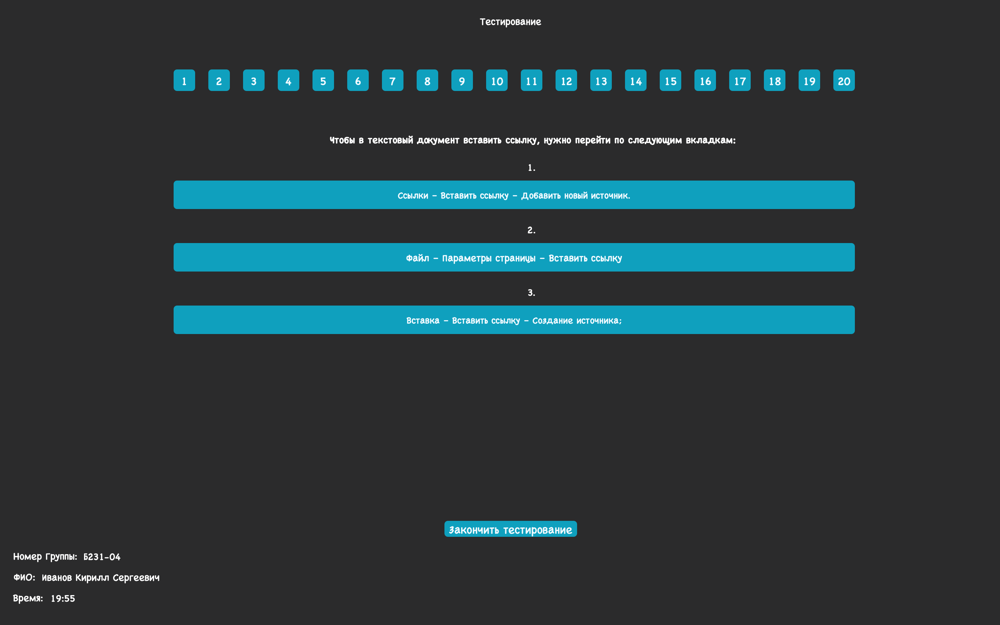

# Программа для ЭВМ по Информатике 

Этот документ описывает программу, разработанную на языке C++ с использованием qmake, предназначенную для использования в Казанском Государственном Аграрном Университете.

## Регистрация

### Регистрация студента

Для начала тестирования студенту необходимо зарегистрироваться, предоставив следующие данные:
```
- ФИО
- Номер группы
```


Регистрация студента принимается только в том случае, если оба эти поля заполнены. После ввода данных, начинается процесс тестирования, и таймер начинает отсчитывать время.

## Тестирование

### Характеристики тестирования

Программа включает в себя 20 вопросов, которые студент должен решить в течение 20 минут. Тем не менее, студент имеет возможность завершить тестирование досрочно, нажав на кнопку ```"Завершить тестирование"```.

 Эта кнопка находится под кнопками выбора ответов. Во время тестирования студент видит таймер и свое ФИО.

## Вопросы и ответы

### Варианты ответов

Для удобства студентов создано 20 кнопок, каждая из которых соответствует номеру задания. При нажатии на кнопку открывается задание с тремя вариантами ответа. Варианты ответа меняются случайным образом для предотвращения списывания. После выбора ответа кнопка с номером задания становится серой, показывая, что студент выбрал ответ на данный вопрос. Изменить выбранный ответ нельзя, чтобы предотвратить списывание между студентами.

## Система оценивания

### Оценка выполненных заданий

Система оценивания зависит от количества выполненных заданий. Например, выполнение 53% (10 заданий) соответствует оценке 3%, 73% (14 заданий) - 4%, и 90% (18 заданий) - 5.

## Итог теста

### Автоматическое подсчет и оценивание

Программа автоматически подсчитывает выполненные задания, вычисляет процент выполнения и присваивает оценку. Студент видит свои данные и оценку, но не видит ошибок, чтобы сохранить конфиденциальность ответов.

## Разработчики

Программа разработана Ивановым Кириллом (никнейм участника школы 21: haywardm, телеграмм: @neekirill) и командой преподавателей ```Казанского Государственного Аграрного Университета```:
````
1. Валиев Абдулсамад Ахатович
2. Королева Валентина Валерьевна
3. Рахматуллина Резида Гайфулловна

```
Дата разработки проекта 1.11.2023
```